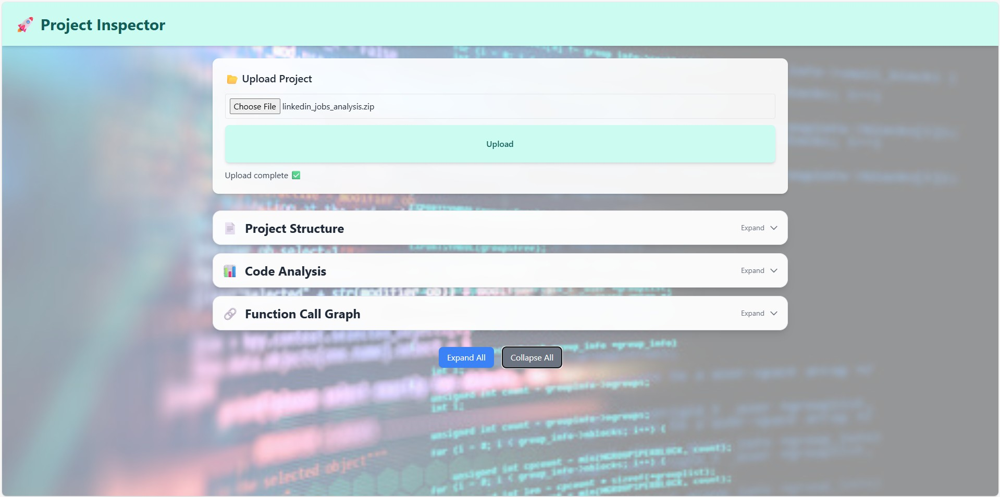

# 🕵️ Project Inspector

**Project Inspector** is a Dockerized full-stack application that analyzes a project folder, generates dependency graphs, and produces AI-based code summaries to help developers quickly understand unfamiliar codebases.

---

## ✨ Features

- 📁 Upload a project folder via web UI  
- 🔗 Generate dependency & call graphs (NetworkX + Graphviz)  
- 🤖 Code summaries (LangChain + AI Models)    
- 🐳 Fully Dockerized setup  

---

## 🏗 Tech Stack

- **Backend:** FastAPI, NetworkX, Graphviz, LangChain  
- **Frontend:** React + Vite, Tailwind CSS, Nginx  
- **DevOps:** Docker, Docker Compose  

---

## 🔑 Environment Variables

Create a `.env` file inside the `backend/` directory:

```bash
GOOGLE_API_KEY=your_google_api_key_here
GROQ_API_KEY=your_groq_api_key_here
```

---

## 🐳 Run with Docker

From the root of the repository:

```bash
docker-compose build --no-cache
docker-compose up
```

- Frontend: http://localhost:3000
- Backend: http://localhost:8000

---

## 🖼️ UI Screenshots

### 🔍 Interface



---

## 📜 License

This project is licensed under the [MIT License](LICENSE).

---
